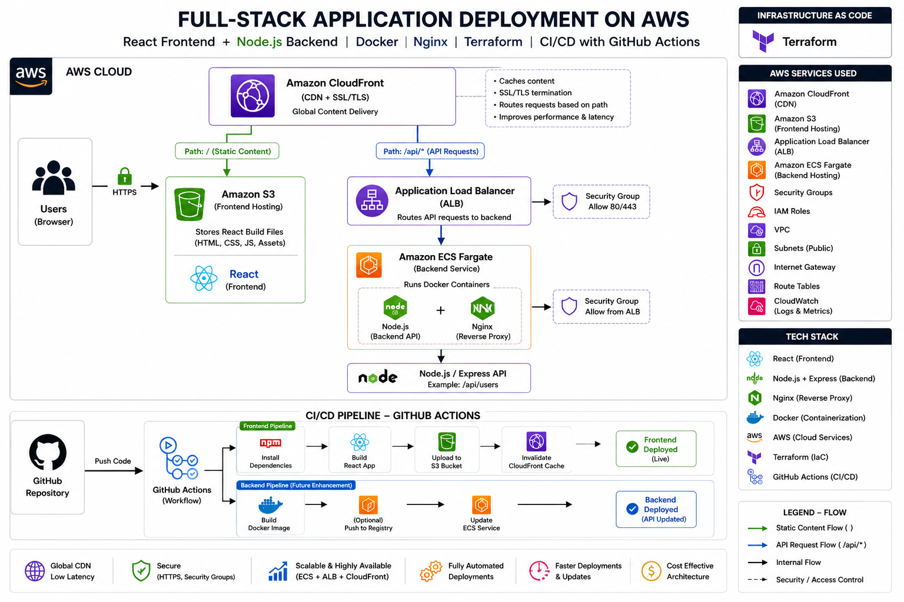

# 🚀 DevFlow Dashboard — Production-Ready Full-Stack AWS Deployment

A production-grade full-stack application deployed on AWS using modern DevOps practices, containerization, and Infrastructure as Code.

---

---

## 🧠 Project Overview

This project demonstrates how to design, deploy, and automate a scalable full-stack application using AWS cloud services.

* Frontend is built with **React (Vite)** and hosted on **S3 + CloudFront**
* Backend is built with **Node.js (Express)**, containerized using **Docker**, and deployed on **ECS Fargate**
* **Nginx** is used as a reverse proxy inside the container
* Infrastructure is provisioned using **Terraform**
* CI/CD pipeline is implemented using **GitHub Actions**

---

## 🏗️ Architecture Diagram

<p align="center">
  
</p>
---

## ⚙️ Tech Stack

### 🔹 Frontend

* React (Vite)
* HTML, CSS, JavaScript

### 🔹 Backend

* Node.js
* Express.js
* Nginx (Reverse Proxy)

### 🔹 DevOps & Cloud

* AWS S3 (Static Hosting)
* AWS CloudFront (CDN + Routing)
* AWS ECS Fargate (Container Hosting)
* AWS ALB (Load Balancer)
* Docker (Containerization)
* Terraform (Infrastructure as Code)
* GitHub Actions (CI/CD)

---

## 🐳 Docker Setup (Backend)

### Dockerfile

```dockerfile
FROM node:18

WORKDIR /app
COPY package*.json ./
RUN npm install

COPY . .

EXPOSE 3000
CMD ["node", "server.js"]
```

---

## 🌐 Nginx Configuration

```nginx
server {
    listen 80;

    location / {
        proxy_pass http://localhost:3000;
    }
}
```

---

---

## 🔐 GitHub Secrets Required

Add these in GitHub → Settings → Secrets:

```
AWS_ACCESS_KEY_ID
AWS_SECRET_ACCESS_KEY
AWS_REGION
S3_BUCKET
CLOUDFRONT_DIST_ID
```

---

## 🧱 Infrastructure (Terraform)

Resources provisioned:

* VPC
* Public Subnets
* Security Groups
* ECS Cluster
* ECS Service
* Application Load Balancer
* S3 Bucket
* CloudFront Distribution

---

## 🚀 Features

* Full-stack architecture on AWS
* CDN-based frontend delivery (CloudFront)
* Containerized backend (Docker + ECS)
* Reverse proxy using Nginx
* Automated CI/CD pipeline
* Scalable and production-ready setup

---

## 📈 Performance Improvements

* ⚡ Reduced deployment time from **5–10 min → <1 min**
* 🌍 ~30–40% lower latency via CloudFront caching
* 🤖 Eliminated manual deployment using CI/CD
* 📊 Improved scalability with ECS + ALB

---

## ⚠️ Challenges & Solutions

* Fixed **CORS & mixed content issues**
* Resolved **CloudFront caching (stale data issue)**
* Debugged **CI/CD failures (Node version mismatch)**
* Solved **frontend-backend communication issues**

---

## 🧠 Key Learnings

* Real-world AWS architecture design
* CI/CD pipeline debugging
* Reverse proxy handling with Nginx
* Infrastructure as Code with Terraform

---

## 📌 Future Improvements

* Backend CI/CD (ECR + ECS auto deploy)
* Monitoring (CloudWatch / Grafana)
* Custom domain with HTTPS (Route53 + ACM)

---

## 🤝 Contributing

Feel free to fork this repo and submit pull requests.

---

## 📄 License

This project is licensed under the MIT License.

---

## ⭐ Support

If you like this project, give it a ⭐ on GitHub!
